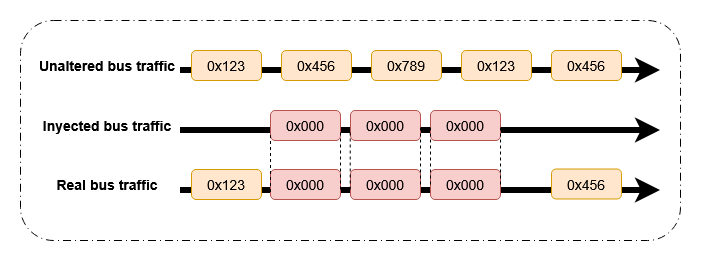
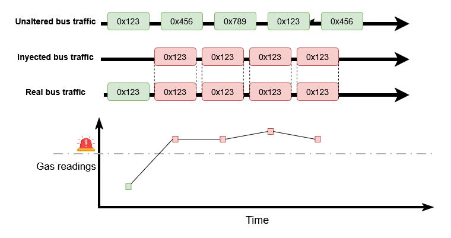
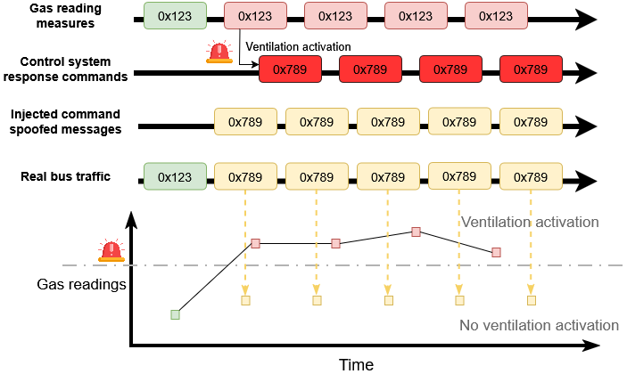

# CAN-based Smart Parking CPS

Research-oriented Cyber-Physical System (CPS) for smart parking built on a Controller Area Network (CAN). The system integrates Arduino-based sensors/actuators, a PIC32MZ CAN gateway, a host-side CAN Intrusion Detection System (IDS), and two attack suites (vision-space adversarial ANPR and in-bus CAN attacks) to evaluate security and robustness end-to-end.

— Designed for reproducible experiments, ablation, and benchmarking in academic/industrial research settings.

## Architecture

The overall system architecture is shown below:


High-level data path: Sensors/Actuators ⇄ CAN Bus ⇄ PIC32MZ Gateway ⇄ Host (IDS, logging, analytics) and Video ⇄ ANPR ⇄ Attack evaluation.

## Threat Model

We evaluate two attacker surfaces: (1) in-bus CAN threats and (2) perception-layer ANPR threats. See the figure below.


## Components

- Industrial network (embedded + host utils): see [industrialNetwork](industrialNetwork/README.md)
  - Sensors/actuators (Arduino sketches):
    - [ambient_transmitter](industrialNetwork/ambient_transmitter/ambient_transmitter.ino)
    - [ultrasonic](industrialNetwork/ultrasonic/ultrasonic.ino)
    - [servoMotor](industrialNetwork/servoMotor/servoMotor.ino)
    - [transmitterCAN](industrialNetwork/transmitterCAN/transmitterCAN.ino)
    - [recieverCAN](industrialNetwork/recieverCAN/recieverCAN.ino)
  - Gateway (PIC32MZ): [industrialNetwork/PIC32MZ/original.c](industrialNetwork/PIC32MZ/original.c)
  - Host-side CAN IDS: [industrialNetwork/NIDS_CAN/main.py](industrialNetwork/NIDS_CAN/main.py)
- Attacks
  - CAN-bus attacks: [attacks/CANbus](attacks/CANbus/README.md)
  - Adversarial ANPR: [attacks/adversarialANPR](attacks/adversarialANPR/README.md)
- Tests and utilities: [tests](tests/README.md)

## Intrusion Detection System (IDS)

The host-side IDS ingests CAN frames via `python-can`, learns a baseline, and detects anomalies. It supports:

- Unknown/invalid IDs and DLC mismatches
- Payload/range deviations for configured sensors
- Rate-based DoS/flooding detection
- Payload pattern deviation

Outputs: SQLite `can_ids.db` (messages, anomalies), console logs, `intrusions.log`, and optional MQTT alerts.

Key tunables (see the IDS source): `window_size`, `frequency_threshold`, `anomaly_threshold`, and `sensor_ranges` mapping.

## Attacks

We provide two complementary attack suites to stress the system and the IDS.

1) CAN-bus Attacks (CLI, `python-can`) — see [attacks/CANbus](attacks/CANbus/README.md)

- Flood (DoS) with configurable ID/rate/payload



- Sensor Data Injection



- Command Spoofing



2) Adversarial ANPR (vision) — see [attacks/adversarialANPR/README.md](attacks/adversarialANPR/README.md)

- Detection denial via bounded perturbations
- Targeted region transfer
- Imperceptible OCR manipulation

Technical report: [Adversarial_Machine_Learning_for_ANPR.pdf](attacks/adversarialANPR/Adversarial_Machine_Learning_for_ANPR.pdf) summarizes methodology, threat model, experiments, and reproduction details. See the folder guide at [attacks/adversarialANPR/README.md](attacks/adversarialANPR/README.md) for code, notebooks, and setup.

## CAN Message Summary

Device-level formats are defined in [industrialNetwork/README.md](industrialNetwork/README.md). Example (temperature):

- ID range: 0x400–0x500
- Payload: 2 bytes, big-endian; value scaled as `°C × 100`
- Example: 85.31°C → 8531 → 0x2152 (MSB=0x21, LSB=0x52)
- Example frame: `423#022152` for ID 0x423

Similar conventions apply to air quality, gas, and ultrasonic occupancy. The barrier (servo) periodically reports state.

Note: The IDS currently validates coarse ranges; if you deploy multi-byte encodings, extend parsing accordingly (see `_detect_anomalies`).

## Quick Start

### 1) Python Environment

Install core packages for the IDS and CAN tooling:

```bash
pip install python-can numpy paho-mqtt
```

For ANPR experiments (notebooks), install:

```bash
pip install -r attacks/adversarialANPR/requirements.txt
```

### 2) CAN Interface

- Linux (SocketCAN):

```bash
sudo ip link set can0 up type can bitrate 500000
# For local tests without hardware:
sudo modprobe vcan
sudo ip link add dev vcan0 type vcan
sudo ip link set up vcan0
```

- Windows: Configure your adapter/channel via vendor tools (e.g., PCAN `PCAN_USBBUS1`, Kvaser channel `0`).

### 3) Run the IDS

```bash
python industrialNetwork/NIDS_CAN/main.py
```

Adjust the CAN interface configuration in the code (e.g., `vcan0`, PCAN, Kvaser) as needed.

### 4) Launch CAN Attacks

```bash
# Help
python attacks/CANbus/can_attacks.py --help

# Flood at 5k fps for 10s (SocketCAN)
python attacks/CANbus/can_attacks.py flood --bus-type socketcan --channel can0 \
  --id 0x123 --dlc 8 --payload-mode random --rate 5000 --duration 10

# Fuzz across standard ID space
python attacks/CANbus/can_attacks.py fuzz --bus-type socketcan --channel can0 \
  --id-range 0x000-0x7FF --min-dlc 0 --max-dlc 8 --payload-mode random --rate 500 --duration 30

# Spoof with fixed payload every 20ms (Windows/Kvaser example)
python attacks/CANbus/can_attacks.py spoof --bus-type kvaser --channel 0 \
  --id 0x321 --dlc 8 --payload 01,02,03,04,05,06,07,08 --period 0.02 --duration 10

# Replay from CSV with timestamp preservation
python attacks/CANbus/can_attacks.py replay --bus-type socketcan --channel can0 \
  --input path/to/log.csv --preserve-timestamps
```

### 5) Run ANPR Experiments

See [attacks/adversarialANPR/README.md](attacks/adversarialANPR/README.md) for full steps. In short:

```bash
pip install -r attacks/adversarialANPR/requirements.txt
# Open and run the notebook
code attacks/adversarialANPR/adversarial_ANPR.ipynb
```

## Data, Logs, and Metrics

- IDS: SQLite `can_ids.db` (tables: `messages`, `anomalies`), `intrusions.log`, optional MQTT alerts
- CAN attack CLI: CSV log of transmitted frames (configurable via `--log`)
- ANPR: saved visualizations and quantitative summaries per attack

Example anomaly query (Linux):

```bash
sqlite3 can_ids.db "SELECT datetime(timestamp,'unixepoch'), can_id, anomaly_type FROM anomalies ORDER BY timestamp DESC LIMIT 10;"
```

## Hardware & Interfaces

- CAN transceivers/shields for Arduino-compatible boards
- PIC32MZ gateway (see [industrialNetwork/PIC32MZ/original.c](industrialNetwork/PIC32MZ/original.c))
- Host CAN adapter
  - Linux: SocketCAN-compatible (e.g., USB–CAN) on `can0`/`vcan0`
  - Windows: Vendor adapters (Peak PCAN, Kvaser) via `python-can`

## How to Cite

If this repository contributes to your research, please cite the accompanying paper referenced in your manuscript. We will add BibTeX here once the final citation/DOI is public. In the meantime, you can reference this repository URL and the paper as listed in your bibliography.


## Ethics and Safe Use

All experiments must be performed on isolated, authorized testbeds. Do not connect experimental setups to public roads or production environments. Follow institutional review processes and responsible disclosure for any discovered issues.

## License

This project is licensed under the terms described in [LICENSE](LICENSE).